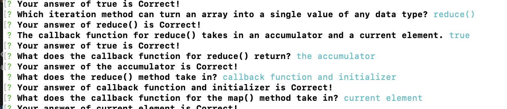

# Flashcards

### Abstract:
This project is a flashcard study app that can be used to prep as a JavaScript study aid. The game is fully playalbe in the terminal, and also can calculate the percentage of questions that are answered correctly.

---
### Installation Instructions:
1. Go to the following link: https://github.com/ben-rosner-williamsburg/flashcards
2. Clone down the repo to your local machine
3. In your machine's Terminal when the repo is the current directory, type in `node index.js`
4. Start playing!
---
### Preview of App:

---
### Context:
This was my Mod 2 first project for my Front End Engineering course at Turing School for Software and Design. I had three days to work on it.

---
### Contributors:
#### Dev Team:
- [Ben Rosner](https://github.com/ben-rosner-williamsburg)
#### Project Manager:
- Robbie Jaeger
---
### Learning Goals:
- Contribute code to an partially constructed application
- Follow spec/prompts to make a working application
- Write modular, reusable code that follows SRP (Single Responsibility Principle)
- Implement a robust testing suite using TDD
---
### Wins + Challenges:

- Wins
  - I was able to finish through iteration 3 of the project.
  - I was able to implement Mocha and Chai tests to implement a BDD approach to testing my code.
  - I was able to use the single responsibility principle fairly well.
- Challenges
  - Completing a project in such a short span of time was extremely challenging.
  - Figuring out how to run the startGame functionality.
  - The createRound functionality was very difficult to figure out.
---